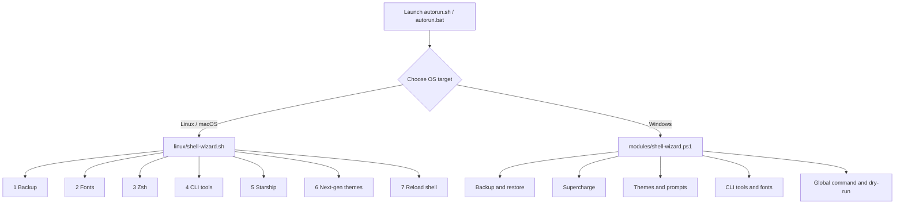

<div align="center">

# 🧙‍♂️ Shell-Wizard Ultimate

### Turn any plain terminal into a fast, beautiful, developer-grade workstation, in minutes.

**Fonts · Prompts · Themes · Plugins · Modern CLI tools · Safe backups**
*One interactive menu. Linux, macOS, and Windows.*

<br>


[Quick Start](#-quick-start) · [Features](#-features) · [Modules](#-modules-in-detail) · [Themes](#-theme-gallery-windows) · [FAQ](#-faq) · [Contributing](#-contributing)

</div>

---

> [!IMPORTANT]
> **First time here? Start with this:**
>
> ```bash
> ./autorun.sh --hard      # or the short form:  ./autorun.sh -f
> ```
>
> Run the launcher in this mode **once, before anything else**. After that, launch normally with `./autorun.sh`.
> On Windows, run **`autorun.bat`** as Administrator.

---

## 📖 Table of Contents

- [Overview](#-overview)
- [Why Shell-Wizard?](#-why-shell-wizard)
- [Features](#-features)
- [Supported Platforms](#-supported-platforms)
- [Requirements](#-requirements)
- [Quick Start](#-quick-start)
- [What You'll See](#-what-youll-see)
- [How It Works](#-how-it-works)
- [Modules in Detail](#-modules-in-detail)
- [Windows PowerShell Engine](#-windows-powershell-engine)
- [Theme Gallery (Windows)](#-theme-gallery-windows)
- [Optional: Global Command](#-optional-global-command-shell-wizard)
- [Repository Structure](#-repository-structure)
- [Safety and Permissions](#-safety-and-permissions)
- [Uninstall and Rollback](#-uninstall-and-rollback)
- [Troubleshooting](#-troubleshooting)
- [FAQ](#-faq)
- [Contributing](#-contributing)
- [Author](#-author)
- [License](#-license)

---

## 🌟 Overview

A great terminal normally takes an afternoon: hunt down a Nerd Font, install Oh My Zsh, clone theme repos, edit `.zshrc` by hand, swap old commands for modern ones, and hope you didn't break your shell config along the way.

**Shell-Wizard Ultimate** does all of it for you from a single menu. It **backs up your current setup first**, then lets you choose exactly what to apply, and lets you **roll back with one click** if you change your mind.

It's built for developers, sysadmins, DevOps engineers, and security analysts who live in the terminal.

---

## 🎯 Why Shell-Wizard?

| Without Shell-Wizard | With Shell-Wizard |
|----------------------|-------------------|
| Hunt for and install fonts manually | One-click Nerd Font install and cache refresh |
| Hand-edit `.zshrc`, `.bashrc`, PowerShell profile | Managed, reversible config changes |
| Break your shell and have no way back | Timestamped backups with one-click restore |
| Different setup steps on every OS | Same experience on Linux, macOS, and Windows |
| Plain `ls`, `cat`, `grep` | `eza`, `bat`, `ripgrep`, `fd`, `fzf`, `atuin` |
| Copy-paste install commands from ten tabs | Everything behind one menu |

---

## ✨ Features

| | Feature | Details |
|---|---------|---------|
| 🔐 | **Backup and rollback** | Timestamped snapshots of shell configs; one-click restore. Windows backups are SHA-256 verified |
| 🔤 | **Nerd Font installer** | MesloLGS NF, JetBrainsMono Nerd Font (and CascadiaCode, FiraCode on Windows) with font-cache refresh |
| ⚡ | **Zsh supercharger** | Oh My Zsh + autosuggestions, syntax highlighting, completions, Powerlevel10k and more |
| 🛠️ | **CLI modernization** | `eza`, `bat`, `fzf`, `fastfetch`, `fd`, `ripgrep` with smart aliases |
| 🚀 | **Starship presets** | Gruvbox Rainbow, Tokyo Night, Nerd Font Symbols, Bracketed, Plain |
| 🌌 | **Next-gen prompts** | Oh My Posh sub-themes, Spaceship presets, Pure, and Atuin history search |
| 🔄 | **Instant reload** | Apply changes without closing your terminal |
| 🪟 | **Native Windows engine** | Dry-run mode, live theme preview, managed profile block, 15-tool installer |
| 🌍 | **Global command** | Optional: run `shell-wizard` from any folder |

---

## 🖥️ Supported Platforms

| Platform | Launcher | Package manager | Status |
|----------|----------|-----------------|--------|
| 🪟 Windows 10 / 11 | `autorun.bat` | `winget` | ✅ Stable, all modules working |
| 🐧 Linux (Debian, Ubuntu, Kali, Fedora/RHEL, Arch) | `autorun.sh` | `apt`, `dnf`, `pacman` | 🚧 Under active development |
| 🍎 macOS | `autorun.sh` | `brew` | 🚧 Under active development |

> **Project status:** Shell-Wizard is designed as a universal tool for all three platforms. The **Windows PowerShell engine is complete and fully runnable**. The Linux/macOS bash modules are still being finished and stabilized, so expect rough edges there. Bug reports and pull requests are especially welcome.

---

## 📋 Requirements

| | Linux / macOS | Windows |
|---|---------------|---------|
| **Shell** | Bash (Zsh optional, installed by the tool) | Windows PowerShell 5.1+ |
| **Tools** | `git`, `curl`, `sudo` | `winget` (App Installer) |
| **Privileges** | `sudo` for package installs | Administrator |
| **Network** | Required for fonts, themes, and packages | Required for fonts, themes, and packages |
| **Terminal font** | A Nerd Font (the tool can install one) | A Nerd Font (the tool can install and apply one) |

---

## 🚀 Quick Start

Shell-Wizard has one launcher per operating system.

| Your OS | Launch with | How |
|---------|-------------|-----|
| 🐧 **Linux** / 🍎 **macOS** | **`autorun.sh`** | `./autorun.sh --hard` the first time, then `./autorun.sh` |
| 🪟 **Windows** | **`autorun.bat`** | Right-click → **Run as administrator** |

### 🐧 Linux / macOS *(🚧 under active development)*

```bash
# 1. Get the code
git clone https://github.com/ali4210/Shell_Wizard.git
cd Shell_Wizard

# 2. First run: use hard mode (long form or short form, both work)
chmod +x autorun.sh
./autorun.sh --hard
#   or
./autorun.sh -f

# 3. Every run after that
./autorun.sh
```

If any script complains about permissions, you can also run the sanitizer:

```bash
bash fix-perms.sh
```

### 🪟 Windows

```powershell
git clone https://github.com/ali4210/Shell_Wizard.git
cd Shell_Wizard
```

1. Right-click **`autorun.bat`** and choose **Run as administrator**.
   (Alternatively, double-click **`shell-wizard.bat`**, which requests elevation for you and then runs `autorun.bat`.)
2. In the gateway menu, choose **[3] Windows Host** to launch the PowerShell engine.
3. Pick a capability from the Windows menu: backup, supercharge, themes, prompts, CLI tools, or fonts.

> **Why Administrator?** Windows needs elevated rights to install fonts and CLI tools through `winget`.

> **Tip:** Take a backup snapshot (Module 1) before you apply anything.

---

## 👀 What You'll See

**The gateway menu** (both launchers open with an ASCII banner, then this):

```text
====================================================================
   🧙‍♂️ SHELL-WIZARD ULTIMATE - OS TARGET SELECTION GATEWAY
====================================================================
Select target operating system environment to customize:

  [1] 🐧 Linux Workstation (Debian, Ubuntu, Kali, RHEL, CentOS, Fedora, Arch)
  [2] 🍎 macOS Terminal (Brew, Zsh, Starship, P10K Suite)
  [3] 🪟 Windows Host (Launch Guidelines for PowerShell / autorun.bat)
  [4] Exit
```

**The Linux/macOS capability menu:**

```text
Main Capabilities Suite:

  [1] Safety & Backup Engine (Backups & Rollback)
  [2] Automated Nerd Font Injector (MesloLGS, JetBrainsMono)
  [3] ZSH & Oh My Zsh Supercharger (P10K, Agnoster, Robbyrussell)
  [4] CLI Modernization & Tooling (eza, bat, fzf, fastfetch, fd, rg)
  [5] Starship Cross-Shell Suite (Tokyo Night, Gruvbox, Symbols)
  [6] Universal Next-Gen Theme & History (Oh My Posh, Spaceship, Pure, Atuin)
  [7] ⚡ 1-Click Apply & Instant Reload Shell (Apply Changes Now)
  [8] 🌐 Enable Global CLI Access (Run 'shell-wizard' from anywhere)
  [9] Exit
```

**The Windows capability menu:**

```text
Windows Capability Suite:

  [1] Safety & Backup Engine (Backups & Restore Engine)
  [2] 1-Click Complete Windows PowerShell Supercharge
  [3] Extended Oh-My-Posh Theme Selector (11 Local Themes + Live Preview)
  [4] Standalone Prompt Selector Engine (Starship, Posh-Git, Pure Native)
  [5] Install Modern CLI Tools Suite (15 Essential Tools)
  [6] Font Studio Engine (Cascadia, JetBrains, FiraCode Auto-Apply)
  [7] Enable Global CLI Access ('shell-wizard' command anywhere)
  [8] Reload Active PowerShell Profile
  [D] Toggle Dry-Run Mode [ON/OFF]
  [9] Exit
```

<!--
📸 Add screenshots here once you have them, for example:


-->

---

## ⚙️ How It Works



**The recommended flow:**

1. **Back up** your current configuration.
2. **Install a Nerd Font** so icons and glyphs render correctly.
3. **Choose your shell setup** (Zsh + Powerlevel10k, Starship, Oh My Posh, etc.).
4. **Modernize your CLI** with faster replacements.
5. **Reload** and enjoy. If you don't like the result, **roll back**.

---

## 🧩 Modules in Detail

The Linux/macOS engine (`linux/shell-wizard.sh`) dispatches to seven modules. *(This engine is still under active development; the Windows engine, described in the next section, is the fully working one.)*

### 🔐 Module 1: Safety & Backup Engine (`backup-engine.sh`)

Protects your existing setup before anything changes.

- Backs up `.zshrc`, `.bashrc`, `.p10k.zsh`, `.config/starship.toml`, and `.config/fish/config.fish`
- Stores timestamped snapshots in `~/.shell_wizard_backups/backup_YYYYMMDD_HHMMSS`
- Interactive restore menu for one-click rollback
- Menu: create snapshot · list and restore · view backup directory

### 🔤 Module 2: Automated Nerd Font Injector (`font-engine.sh`)

Fixes broken icons (Git branches, OS logos, Docker symbols) in your prompt.

- Scans the system for installed Nerd Fonts
- Installs **MesloLGS NF** (recommended for Powerlevel10k) and **JetBrainsMono Nerd Font**
- Installs to `~/.local/share/fonts` (Linux) or `~/Library/Fonts` (macOS) and refreshes the font cache
- Shows setup directions for VS Code, macOS Terminal / iTerm2, Windows Terminal, and GNOME/Kali Terminal

### ⚡ Module 3: ZSH & Oh My Zsh Supercharger (`zsh-engine.sh`)

- Installs Oh My Zsh unattended (backs up first)
- Installs plugins: `zsh-autosuggestions`, `zsh-syntax-highlighting`, `zsh-completions`, and enables `sudo` and `autojump`
- Theme selector: **Powerlevel10k**, **Agnoster**, **Robbyrussell**, **Bira**, **Simple**
- Launches the interactive `p10k configure` wizard

### 🛠️ Module 4: CLI Modernization & Tooling (`cli-tools.sh`)

Installs modern tools through `brew`, `apt`, `dnf`, or `pacman`, and injects smart aliases into `.zshrc` and `.bashrc`.

| Legacy | Replacement | Benefit |
|--------|-------------|---------|
| `ls` | `eza` | Icons, colors, tree view |
| `cat` | `bat` | Syntax highlighting |
| `find` | `fd` | Faster, friendlier syntax |
| `grep` | `ripgrep` (`rg`) | Very fast recursive search |
| `neofetch` | `fastfetch` | Faster system info |
| history search | `fzf` / `atuin` | Fuzzy and searchable history |

Also available: enable a system dashboard (`fastfetch`) on every new terminal.

### 🚀 Module 5: Starship Cross-Shell Suite (`starship-engine.sh`)

Installs [Starship](https://starship.rs) and initializes it in your shell config. Presets: **Gruvbox Rainbow**, **Tokyo Night**, **Nerd Font Symbols**, **Bracketed Segments**, **Plain Minimal**.

### 🌌 Module 6: Universal Next-Gen Theme & History (`nextgen-engine.sh`)

| Option | What you get |
|--------|--------------|
| **Oh My Posh** | Sub-themes: Jebree, Paradox, Agnoster, Bubbles, M365princess |
| **Spaceship** | Presets: Full-Stack DevOps, Minimalist Fast, Two-Line |
| **Pure** | Blazing-fast minimalist single-line prompt |
| **Atuin** | SQLite-backed shell history with fuzzy search on `Ctrl+R` / `↑` |

### ⚡ Module 7: Instant Shell Reloader (`reload-engine.sh`)

Detects your active shell and runs `exec zsh` or `exec bash` so themes, plugins, and aliases apply immediately without closing the terminal.

---

## 🪟 Windows PowerShell Engine

`modules/shell-wizard.ps1` is a full orchestrator built for Windows.

| Capability | What it does |
|------------|--------------|
| **Managed profile block** | Only edits the section of `$PROFILE` between its own `SHELL-WIZARD MANAGED BLOCK` markers; the rest of your profile is untouched |
| **Dry-run mode** | Press `D` in the main menu to preview every change before anything is written |
| **Verified backups** | SHA-256 hashed, atomic copies of your PowerShell profile and Windows Terminal `settings.json`, with a manifest and automatic pruning to the 10 newest snapshots |
| **Safe restore** | Integrity-checks a snapshot before restoring and saves a safety snapshot of your current state first |
| **Live theme preview** | See the prompt rendered before you apply it |
| **Font injection** | Sets the Nerd Font in Windows Terminal `settings.json` automatically (with a backup) |
| **State tracking** | Remembers active engine, theme, font, and installed tools in `~/.shell_wizard/current.json` |
| **Idempotent CLI installer** | Detects what is installed and only installs what's missing via `winget` |
| **Prompt engines** | Oh My Posh, Starship, Posh-Git, or a dependency-free native prompt |
| **Font Studio** | CascadiaCode, JetBrainsMono, FiraCode, or reset to Cascadia Mono |

**The 15 CLI tools installed on Windows:**

`eza` · `bat` · `fastfetch` · `atuin` · `starship` · `ripgrep` · `zoxide` · `fzf` · `lazygit` · `delta` · `fd` · `dust` · `procs` · `bottom` · `gh`

---

## 🎨 Theme Gallery (Windows)

Eleven Oh My Posh themes ship locally in `modules/themes/`, so theme switching works **offline** and with a **live preview** before you apply.

| Theme | Style | Segments |
|-------|-------|----------|
| **Jebree** *(default)* | Blue, red, and yellow powerline | OS icon → folder path → Git branch |
| **Paradox** | Classic powerline | Path → Git branch |
| **Agnoster** | Clean, minimal status prompt | User → path |
| **Bubbles** | Rounded purple pill | Path |
| **Dracula** | Purple, pink, and green | OS icon → path → Git branch |
| **Blueish** | Cyan-blue powerline | User → path → Git branch |
| **Tokyo Night** | Pastel neon dark | Clock → path → Git branch |
| **Catppuccin Mocha** | Soft pastel | User → path → Git branch |
| **Gruvbox** | Warm retro | Path → Git branch |
| **Nord** | Cool arctic blue | Path → Git branch |
| **Rose Pine** | Vintage soft palette | Path → Git branch |

> All prompt themes rely on Nerd Font glyphs. Set your terminal font to a Nerd Font or icons will render as empty boxes.

---

## 🌍 Optional: Global Command (`shell-wizard`)

Not required. `autorun.sh` and `autorun.bat` work on their own. If you want to start the tool from any folder by typing `shell-wizard`, install the global command once.

**Linux / macOS**

```bash
bash install.sh
```

This makes scripts executable and symlinks `autorun.sh` to `/usr/local/bin/shell-wizard` (uses `sudo`). Then, from any terminal:

```bash
shell-wizard
```

**Windows**

```powershell
.\install.ps1
```

This creates a `shell-wizard.bat` wrapper in `%LOCALAPPDATA%\Microsoft\WindowsApps` and adds a `shell-wizard` function to your PowerShell profile. If your execution policy is `Restricted` or `Undefined`, the installer asks for your consent before changing it to `RemoteSigned` for the **current user only**. Open a new PowerShell window afterwards.

---

## 📁 Repository Structure

```text
Shell_Wizard/
├── autorun.sh              # Linux/macOS gateway launcher
├── autorun.bat             # Windows gateway launcher (requires admin)
├── shell-wizard.bat        # Windows launcher with auto-elevation
├── install.sh              # Global CLI installer (Linux/macOS)
├── install.ps1             # Global CLI installer (Windows)
├── fix-perms.sh            # Sets +x on all .sh files
├── banner_wrapper.txt      # ASCII banner for the gateway
├── README.md
├── linux/
│   └── shell-wizard.sh     # Linux/macOS main menu engine
└── modules/
    ├── backup-engine.sh    # Module 1: backup and restore
    ├── font-engine.sh      # Module 2: Nerd Fonts
    ├── zsh-engine.sh       # Module 3: Zsh / Oh My Zsh / P10K
    ├── cli-tools.sh        # Module 4: modern CLI tools
    ├── starship-engine.sh  # Module 5: Starship
    ├── nextgen-engine.sh   # Module 6: Oh My Posh / Spaceship / Pure / Atuin
    ├── reload-engine.sh    # Module 7: instant reload
    ├── shell-wizard.ps1    # Windows PowerShell orchestrator
    ├── banner.txt          # ASCII banner
    └── themes/             # 11 Oh My Posh theme files (.omp.json)
```

**Tech stack:** Bash · PowerShell · Batch · JSON (Oh My Posh themes)

---

## 🔒 Safety and Permissions

Shell-Wizard changes shell configuration files and installs software, so please read this before running it:

- **Back up first.** Use Module 1 (Linux/macOS) or the Safety & Backup Engine (Windows) before applying anything.
- **`sudo` / admin is used** for package installs and for creating the global `/usr/local/bin/shell-wizard` symlink on Linux/macOS.
- **Remote installers are downloaded and executed** for Oh My Zsh, Starship, Oh My Posh, and Atuin, each from its official source. Review them if you have strict security requirements.
- **Windows launchers use `-ExecutionPolicy Bypass`** for the session that runs the engine. `install.ps1` only changes the policy with your explicit consent and only for the current user.
- Use **Dry-Run mode** on Windows to preview changes.

---

## ♻️ Uninstall and Rollback

**Undo your changes (recommended):** use the restore option in Module 1 (Linux/macOS) or **[1] Safety & Backup Engine → Rollback** on Windows. Backups live in `~/.shell_wizard_backups/`.

**Remove the global command:**

```bash
# Linux / macOS
sudo rm /usr/local/bin/shell-wizard
```

```powershell
# Windows: delete the wrapper, then remove the `shell-wizard` function from your $PROFILE
Remove-Item "$env:LOCALAPPDATA\Microsoft\WindowsApps\shell-wizard.bat"
```

**Remove the tool itself:** delete the `Shell_Wizard` folder. Windows state lives in `~/.shell_wizard/`.

---

## 🩺 Troubleshooting

| Problem | Fix |
|---------|-----|
| `Permission denied` on a script | Run `./autorun.sh --hard`, or `bash fix-perms.sh`, or `chmod +x autorun.sh` |
| Icons show as `□` or `?` | Install a Nerd Font and select it in your terminal settings (Module 2, option 4 has directions) |
| `shell-wizard` not found after install | Open a **new** terminal window |
| Changes not visible | Use Module 7, or run `exec zsh` / `exec bash` |
| Windows: "Administrator privileges required" | Right-click `autorun.bat` → **Run as administrator**, or use `shell-wizard.bat` |
| Windows: theme resets on new tab | Allow the execution policy change in `install.ps1`, or run `Set-ExecutionPolicy RemoteSigned -Scope CurrentUser` |
| Windows: `winget` not found | Install **App Installer** from the Microsoft Store |
| Restore a previous state | Linux/macOS: Module 1 → option 2. Windows: option 1 → Rollback |

---

## ❓ FAQ

**Do I need to install the global command?**
No. It's optional. Launch with `autorun.sh` (Linux/macOS) or `autorun.bat` (Windows).

**Why should I run `./autorun.sh --hard` first?**
It's the recommended first-run mode. Run it once, then use plain `./autorun.sh` afterwards. `-f` is the short form.

**Will it overwrite my existing config?**
It takes a backup first and lets you restore it. On Windows, changes go only inside a managed block in your profile.

**Why do I see broken icons?**
Your terminal isn't using a Nerd Font. Install one with Module 2 (or Font Studio on Windows), then select it in your terminal settings.

**Does it work on WSL?**
Run `autorun.sh` inside your WSL distro as you would on Linux. Windows Terminal font settings still need to be applied on the Windows side.

**Which platform is the most complete?**
Windows. The Linux/macOS engine is under active development.

---

## 🤝 Contributing

Contributions, bug reports, and ideas are welcome, especially for the Linux/macOS engine.

1. Fork the repository
2. Create a branch: `git checkout -b feature/my-feature`
3. Commit your changes: `git commit -m "Add my feature"`
4. Push: `git push origin feature/my-feature`
5. Open a Pull Request

Found a bug? [Open an issue](https://github.com/ali4210/Shell_Wizard/issues) and include your OS, shell, and the module you were using.

---

## 👤 Author

**Saleem Ali**, DevOps / Security enthusiast and open-source contributor

- GitHub: [github.com/ali4210](https://github.com/ali4210)
- LinkedIn: [linkedin.com/in/saleem-ali-189719325](https://www.linkedin.com/in/saleem-ali-189719325/)

If this project helped you, please give it a ⭐ on GitHub. It really helps.

---

## 📄 License

Distributed under the **MIT License**. See the `LICENSE` file for details.

---

<div align="center">

*Make your terminal your masterpiece.* 🧙‍♂️

</div>