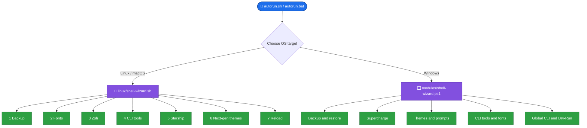
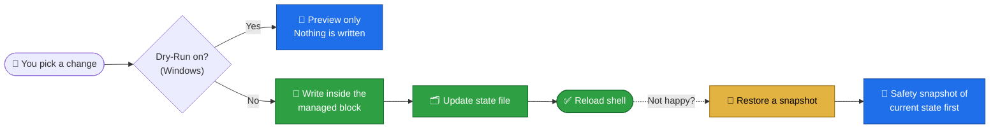
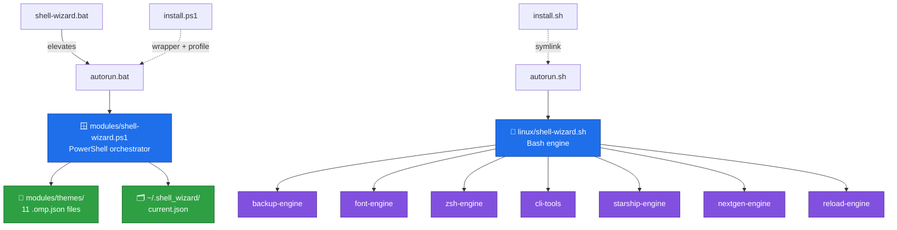

<div align="center">


<a href="https://github.com/ali4210/Shell_Wizard">
  
</a>

<br/>


**A cross-platform CLI suite that turns hours of terminal setup into a guided, menu-driven, _reversible_ experience.**

Built for developers, sysadmins, DevOps and security engineers who live in the terminal and want a fast, beautiful, modern setup without hand-editing config files.

<br/>

[**Why**](#why) · [**Features**](#features) · [**Install**](#install) · [**Preview**](#preview) · [**Modules**](#modules) · [**Windows Engine**](#windows) · [**Themes**](#themes) · [**Safety**](#safety) · [**Architecture**](#architecture) · [**FAQ**](#faq) · [**Roadmap**](#roadmap)

</div>

---

<a id="glance"></a>

## ⚡ At a Glance

<table align="center">
  <tr>
    <td align="center"><h3>7</h3><sub>Linux/macOS<br/>modules</sub></td>
    <td align="center"><h3>2</h3><sub>Native engines<br/>(Bash + PowerShell)</sub></td>
    <td align="center"><h3>3</h3><sub>Operating systems<br/>(Linux, macOS, Windows)</sub></td>
    <td align="center"><h3>11</h3><sub>Offline themes<br/>with live preview</sub></td>
    <td align="center"><h3>15</h3><sub>CLI tools on Windows<br/>(eza, bat, lazygit...)</sub></td>
    <td align="center"><h3>1</h3><sub>Click to roll back<br/>a snapshot</sub></td>
  </tr>
</table>

> [!TIP]
> **In 30 seconds:** clone the repo, run `./autorun.sh` (Linux/macOS) or right-click `autorun.bat` → *Run as administrator* (Windows), then drive everything from numbered menus. Take a backup snapshot first, and you can always roll back.

> [!IMPORTANT]
> **First time here?** Launch once in first-run mode before anything else:
>
> ```bash
> ./autorun.sh --hard      # or the short form:  ./autorun.sh -f
> ```
>
> After that, launch normally with `./autorun.sh`. On Windows, use **`autorun.bat`** as Administrator.

---

<a id="why"></a>

## 🎯 Why Shell-Wizard?

A great terminal normally costs an afternoon:

- 🔤 Hunt down a Nerd Font, unzip it, copy it, refresh the cache, then find where your terminal keeps its font setting
- 📝 Hand-edit `.zshrc`, `.bashrc` or a PowerShell profile and hope nothing breaks
- 🎨 Try a prompt theme, restart, dislike it, try another
- 🧰 Install a dozen modern CLI tools one command at a time
- 🔁 Repeat everything on every new machine

Most guides leave you copy-pasting commands from ten tabs. Shell-Wizard puts the whole workflow behind **one menu**, with **backups and rollback** so experimenting is safe.

### 🥊 By Hand vs Shell-Wizard

| Situation | 😬 By hand | 🧙 Shell-Wizard |
|---|---|---|
| Install a Nerd Font | Download, unzip, copy, `fc-cache`, configure terminal | **One click**, cache refreshed, terminal directions shown (font auto-applied on Windows Terminal) |
| Try a prompt theme | Edit config, reload, repeat | Pick from a menu; **live preview** before applying on Windows |
| Change your PowerShell profile | Edit `$PROFILE` and risk clobbering your own lines | Writes only inside a **managed block**, the rest is untouched |
| Something breaks | Hope you kept a copy | **Timestamped snapshots** with one-click restore (SHA-256 verified on Windows) |
| Install modern CLI tools | Look up each package name per OS | **One step**: detects `brew` / `apt` / `dnf` / `pacman` / `winget` |
| Re-run the setup | Duplicate aliases and profile lines | **Idempotent**: already-installed tools and aliases are detected and skipped |
| "What would this change?" | No way to know | **Dry-Run mode** (Windows) prints exactly what would be written |
| New machine | Start from scratch | Clone, run, pick your setup |

---

<a id="features"></a>

## ✨ Feature Tour

| | Feature | Details |
|:-:|---|---|
| 🔐 | **Backup and rollback** | Timestamped snapshots of shell configs with one-click restore. Windows snapshots are SHA-256 verified and integrity-checked before restoring |
| 🔤 | **Nerd Font installer** | MesloLGS NF and JetBrainsMono Nerd Font (plus CascadiaCode and FiraCode on Windows) with font-cache refresh |
| ⚡ | **Zsh supercharger** | Oh My Zsh, autosuggestions, syntax highlighting, completions, Powerlevel10k and more |
| 🛠️ | **CLI modernization** | `eza`, `bat`, `fzf`, `fastfetch`, `fd`, `ripgrep` with smart aliases |
| 🚀 | **Starship presets** | Gruvbox Rainbow, Tokyo Night, Nerd Font Symbols, Bracketed, Plain |
| 🌌 | **Next-gen prompts** | Oh My Posh sub-themes, Spaceship presets, Pure, Atuin history search |
| 🎨 | **11 offline themes** | Ship locally for Windows, so theme switching works without internet |
| 🧪 | **Dry-Run mode** | Preview every change before anything is written *(Windows)* |
| 🔄 | **Instant reload** | Apply changes without closing your terminal |
| 🌍 | **Global command** | Optional: run `shell-wizard` from any folder |

<details>
<summary><b>🔍 Which features exist on which platform?</b> (click to expand)</summary>

<br/>

See the full [parity table](#parity) further down.

</details>

---

<a id="platforms"></a>

## 🖥️ Supported Platforms

| Platform | Launcher | Package manager | Status |
|---|---|---|:-:|
| 🪟 Windows 10 / 11 | `autorun.bat` | `winget` | ✅ Stable, all modules working |
| 🐧 Linux (Debian, Ubuntu, Kali, Fedora/RHEL, Arch) | `autorun.sh` | `apt`, `dnf`, `pacman` |  | ✅ Stable, all modules working |
| 🍎 macOS | `autorun.sh` | `brew` | 🚧 Under active development |

> [!NOTE]
> Shell-Wizard is designed as a universal tool for all three platforms. The **Windows PowerShell engine is complete and fully runnable**. The Linux/macOS bash modules are still being finished and stabilized, so expect rough edges there. Bug reports and pull requests are especially welcome.

---

<a id="install"></a>

## 🛠️ Installation

### 📋 Requirements

| | 🐧 Linux / 🍎 macOS | 🪟 Windows |
|---|---|---|
| **Shell** | Bash (Zsh is optional and installed by the tool) | Windows PowerShell 5.1+ |
| **Tools** | `git`, `curl`, `sudo` | `winget` (App Installer from the Microsoft Store) |
| **Privileges** | `sudo` for package installs | Administrator |
| **Network** | Needed for fonts, themes and packages | Needed for fonts, themes and packages |
| **Terminal font** | A Nerd Font (the tool can install one) | A Nerd Font (the tool can install and apply one) |

### 🐧 Linux and macOS *(🚧 under active development)*

```bash
# 1. Get the code
git clone https://github.com/ali4210/Shell_Wizard.git
cd Shell_Wizard

# 2. First run: use first-run mode (long form or short form, both work)
chmod +x autorun.sh
./autorun.sh --hard
#   or
./autorun.sh -f

# 3. Every run after that
./autorun.sh
```

If a script complains about permissions, run the sanitizer:

```bash
bash fix-perms.sh
```

### 🪟 Windows

```powershell
git clone https://github.com/ali4210/Shell_Wizard.git
cd Shell_Wizard
```

1. Right-click **`autorun.bat`** and choose **Run as administrator**.
   (Or double-click **`shell-wizard.bat`**, which requests elevation and then runs `autorun.bat`.)
2. In the gateway menu choose **[3] Windows Host** to launch the PowerShell engine.
3. Pick a capability: backup, supercharge, themes, prompts, CLI tools or fonts.

> [!NOTE]
> **Why Administrator?** Windows needs elevated rights to install fonts and CLI tools through `winget`.

### 🌍 Optional: Global command

Not required. `autorun.sh` and `autorun.bat` work on their own. Install the global command only if you want to type `shell-wizard` from any folder.

| Platform | Command | What it does |
|---|---|---|
| 🐧 / 🍎 | `bash install.sh` | Makes scripts executable and symlinks `autorun.sh` to `/usr/local/bin/shell-wizard` (uses `sudo`) |
| 🪟 | `.\install.ps1` | Creates a `shell-wizard.bat` wrapper in `%LOCALAPPDATA%\Microsoft\WindowsApps` and adds a `shell-wizard` function to your PowerShell profile |

On Windows, if your execution policy is `Restricted` or `Undefined`, the installer asks for your consent before changing it to `RemoteSigned` for the **current user only**. Open a new terminal afterwards.

---

<a id="preview"></a>

## 🖥️ See It in Action

> [!NOTE]
> The screens below reproduce the real menu layouts. Timestamps are illustrative.

<details open>
<summary><b>🚪 The gateway menu</b> (both launchers open with an ASCII banner, then this)</summary>

```text
====================================================================
   🧙‍♂️ SHELL-WIZARD ULTIMATE - OS TARGET SELECTION GATEWAY
====================================================================
Select target operating system environment to customize:

  [1] 🐧 Linux Workstation (Debian, Ubuntu, Kali, RHEL, CentOS, Fedora, Arch)
  [2] 🍎 macOS Terminal (Brew, Zsh, Starship, P10K Suite)
  [3] 🪟 Windows Host (Launch Guidelines for PowerShell / autorun.bat)
  [4] Exit
```

</details>

<details>
<summary><b>🐧 Linux/macOS capability menu</b></summary>

```text
Main Capabilities Suite:

  [1] Safety & Backup Engine (Backups & Rollback)
  [2] Automated Nerd Font Injector (MesloLGS, JetBrainsMono)
  [3] ZSH & Oh My Zsh Supercharger (P10K, Agnoster, Robbyrussell)
  [4] CLI Modernization & Tooling (eza, bat, fzf, fastfetch, fd, rg)
  [5] Starship Cross-Shell Suite (Tokyo Night, Gruvbox, Symbols)
  [6] Universal Next-Gen Theme & History (Oh My Posh, Spaceship, Pure, Atuin)
  [7] ⚡ 1-Click Apply & Instant Reload Shell (Apply Changes Now)
  [8] 🌐 Enable Global CLI Access (Run 'shell-wizard' from anywhere)
  [9] Exit
```

</details>

<details>
<summary><b>🪟 Windows capability menu</b></summary>

```text
[STATUS] Engine: Oh My Posh | Theme: Jebree | Font: CaskaydiaCove Nerd Font
[GLOBAL] CLI Command: Enabled [shell-wizard]
[DRY-RUN] [OFF - LIVE WRITES]

Windows Capability Suite:

  [1] Safety & Backup Engine (Backups & Restore Engine)
  [2] 1-Click Complete Windows PowerShell Supercharge
  [3] Extended Oh-My-Posh Theme Selector (11 Local Themes + Live Preview)
  [4] Standalone Prompt Selector Engine (Starship, Posh-Git, Pure Native)
  [5] Install Modern CLI Tools Suite (15 Essential Tools)
  [6] Font Studio Engine (Cascadia, JetBrains, FiraCode Auto-Apply)
  [7] Enable Global CLI Access ('shell-wizard' command anywhere)
  [8] Reload Active PowerShell Profile
  [D] Toggle Dry-Run Mode [ON/OFF]
  [9] Exit
```

</details>

<details>
<summary><b>🧪 Dry-Run: preview before anything is written</b> (Windows)</summary>

```text
[DRY-RUN] Preview of Managed Block to be written to $PROFILE:
# >>> SHELL-WIZARD MANAGED BLOCK >>>
Import-Module Terminal-Icons -ErrorAction SilentlyContinue
Import-Module PSReadLine -ErrorAction SilentlyContinue
Set-PSReadLineOption -PredictionSource History -ErrorAction SilentlyContinue
oh-my-posh init pwsh --config '...\modules\themes\dracula.omp.json' | Invoke-Expression
# <<< SHELL-WIZARD MANAGED BLOCK <<<
```

</details>

<details>
<summary><b>🔐 Restore menu with integrity badges</b> (Windows)</summary>

```text
VERIFIED ROLLBACK / RESTORE

Available Backups:
  [1] backup_20260920_135001  [VERIFIED]
  [2] backup_20260918_204512  [VERIFIED]
  [3] backup_20260910_091130  [UNVERIFIED]

Select backup number to restore [1-3] (or C to cancel):
```

</details>

<!-- 📸 Add real screenshots here for maximum impact:
<p align="center"></p>
<p align="center"></p>
-->

---

<a id="workflow"></a>

## ⚙️ How It Works



**The recommended flow:**

1. 🔐 **Back up** your current configuration.
2. 🔤 **Install a Nerd Font** so icons and glyphs render correctly.
3. 🎨 **Choose your shell setup** (Zsh + Powerlevel10k, Starship, Oh My Posh, and so on).
4. 🛠️ **Modernize your CLI** with faster replacements.
5. 🔄 **Reload** and enjoy. Don't like it? **Roll back**.

### 🧭 Recipes

| I want to... | 🐧 Linux / 🍎 macOS | 🪟 Windows |
|---|---|---|
| Fix broken icons | `2` → `2` or `3` (install a font) | `6` → pick a font |
| Get Oh My Zsh + Powerlevel10k | `3` → `1` | n/a |
| Try a prompt theme with preview | `6` → `1` (Oh My Posh) | `3` → pick a theme → confirm |
| Use Starship | `5` → `1`, then `2` for presets | `4` → `1` |
| Install modern CLI tools | `4` → `1` | `5` |
| Preview changes without writing | n/a | press `D` |
| Undo my changes | `1` → `2` | `1` → `2` |
| Start from any folder | `8` (or `bash install.sh`) | `7` (or `.\install.ps1`) |
| Apply changes without restarting | `7` | `8` |

---

<a id="modules"></a>

## 🧩 Modules in Detail (Linux / macOS)

> [!NOTE]
> The Linux/macOS engine (`linux/shell-wizard.sh`) is still under active development. The Windows engine, described in the [next section](#windows), is the fully working one.

<details>
<summary><b>🔐 Module 1 · Safety & Backup Engine</b> (<code>backup-engine.sh</code>)</summary>

<br/>

| Capability | Details |
|---|---|
| **Snapshot** | Copies `.zshrc`, `.bashrc`, `.p10k.zsh`, `.config/starship.toml` and `.config/fish/config.fish` into `~/.shell_wizard_backups/backup_YYYYMMDD_HHMMSS` |
| **Restore** | Interactive list of snapshots with one-click restore |
| **Auto-backup** | A snapshot is also taken automatically right before Oh My Zsh is installed |
| **Browse** | View the backup directory from the menu |

</details>

<details>
<summary><b>🔤 Module 2 · Automated Nerd Font Injector</b> (<code>font-engine.sh</code>)</summary>

<br/>

Fixes broken icons (Git branches, OS logos, Docker symbols) in your prompt.

- Scans the system for installed Nerd Fonts
- Installs **MesloLGS NF** (recommended for Powerlevel10k) and **JetBrainsMono Nerd Font**
- Installs to `~/.local/share/fonts` (Linux) or `~/Library/Fonts` (macOS), then refreshes the font cache
- Shows setup directions for VS Code, macOS Terminal / iTerm2, Windows Terminal and GNOME / Kali Terminal

</details>

<details>
<summary><b>⚡ Module 3 · ZSH & Oh My Zsh Supercharger</b> (<code>zsh-engine.sh</code>)</summary>

<br/>

- Installs Oh My Zsh unattended
- Installs plugins: `zsh-autosuggestions`, `zsh-syntax-highlighting`, `zsh-completions`, and enables `sudo` and `autojump`
- Theme selector: **Powerlevel10k**, **Agnoster**, **Robbyrussell**, **Bira**, **Simple**
- Launches the interactive `p10k configure` wizard

</details>

<details>
<summary><b>🛠️ Module 4 · CLI Modernization & Tooling</b> (<code>cli-tools.sh</code>)</summary>

<br/>

Installs modern tools through `brew`, `apt`, `dnf` or `pacman`, then injects smart aliases into `.zshrc` and `.bashrc`.

| Legacy | Replacement | Benefit |
|---|---|---|
| `ls` | `eza` | Icons, colors, tree view |
| `cat` | `bat` | Syntax highlighting |
| `find` | `fd` | Faster, friendlier syntax |
| `grep` | `ripgrep` (`rg`) | Very fast recursive search |
| `neofetch` | `fastfetch` | Faster system info |
| history search | `fzf` | Fuzzy finder |

Also available: show a `fastfetch` system dashboard on every new terminal.

</details>

<details>
<summary><b>🚀 Module 5 · Starship Cross-Shell Suite</b> (<code>starship-engine.sh</code>)</summary>

<br/>

Installs [Starship](https://starship.rs) and initializes it in your shell config. Presets: **Gruvbox Rainbow**, **Tokyo Night**, **Nerd Font Symbols**, **Bracketed Segments** and **Plain Minimal**.

</details>

<details>
<summary><b>🌌 Module 6 · Universal Next-Gen Theme & History</b> (<code>nextgen-engine.sh</code>)</summary>

<br/>

| Option | What you get |
|---|---|
| **Oh My Posh** | Sub-themes: Jebree, Paradox, Agnoster, Bubbles, M365princess |
| **Spaceship** | Presets: Full-Stack DevOps, Minimalist Fast, Two-Line (requires Oh My Zsh, so run Module 3 first) |
| **Pure** | Fast minimalist single-line prompt |
| **Atuin** | SQLite-backed shell history with fuzzy search on `Ctrl+R` / `↑` |

</details>

<details>
<summary><b>⚡ Module 7 · Instant Shell Reloader</b> (<code>reload-engine.sh</code>)</summary>

<br/>

Detects your active shell and runs `exec zsh` or `exec bash`, so themes, plugins and aliases apply immediately without closing the terminal.

</details>

---

<a id="windows"></a>

## 🪟 Windows PowerShell Engine

`modules/shell-wizard.ps1` is a full orchestrator built for Windows.

| Capability | What it does |
|---|---|
| 🧱 **Managed profile block** | Only edits the section of `$PROFILE` between its own `SHELL-WIZARD MANAGED BLOCK` markers. The rest of your profile is untouched |
| 🧪 **Dry-Run mode** | Press `D` in the main menu to preview every change before anything is written |
| 🔐 **Verified backups** | SHA-256 hashed, atomic copies (with retries) of your PowerShell profile and Windows Terminal `settings.json`, plus a manifest. Only the 10 newest snapshots are kept |
| 🛟 **Safe restore** | Integrity-checks a snapshot, then saves a safety snapshot of your current state before overwriting anything, so even a rollback is reversible |
| 👀 **Live theme preview** | See the prompt rendered before you apply it |
| 🔤 **Font injection** | Sets the Nerd Font in Windows Terminal `settings.json` automatically, after making a `.bak_<timestamp>` copy |
| 🗂️ **State tracking** | Remembers active engine, theme, font and installed tools in `~/.shell_wizard/current.json` |
| ♻️ **Idempotent CLI installer** | Detects what is installed and only installs what is missing via `winget` |
| 🎛️ **Prompt engines** | Oh My Posh, Starship, Posh-Git, or a dependency-free native prompt |
| 🔠 **Font Studio** | CascadiaCode, JetBrainsMono, FiraCode, or reset to Cascadia Mono |

**The 15 CLI tools installed on Windows:**

`eza` · `bat` · `fastfetch` · `atuin` · `starship` · `ripgrep` · `zoxide` · `fzf` · `lazygit` · `delta` · `fd` · `dust` · `procs` · `bottom` · `gh`

<details>
<summary><b>🗂️ What the state file looks like</b></summary>

<br/>

```json
{
  "ActiveEngine": "Oh My Posh",
  "ActiveTheme": "Jebree",
  "ActiveFont": "CaskaydiaCove Nerd Font",
  "InstalledCLI": ["eza", "bat", "fastfetch", "starship", "ripgrep", "fzf"],
  "GlobalAlias": "Enabled",
  "LastUpdated": "2026-09-20 13:50:01"
}
```

The status header on every screen reads from this file.

</details>

---

<a id="themes"></a>

## 🎨 Theme Gallery (Windows)

Eleven Oh My Posh themes ship locally in `modules/themes/`, so switching works **offline**, with a **live preview** before you apply.

| Theme | Palette | Style | Segments |
|---|---|---|---|
| **Jebree** *(default)* |    | Blue, red and yellow powerline | OS icon → folder path → Git branch |
| **Paradox** |   | Classic powerline | Path → Git branch |
| **Agnoster** |   | Clean status prompt | User → path |
| **Bubbles** |  | Rounded purple pill | Path |
| **Dracula** |    | Purple, pink and green | OS icon → path → Git branch |
| **Blueish** |    | Cyan-blue powerline | User → path → Git branch |
| **Tokyo Night** |    | Pastel neon dark | Clock → path → Git branch |
| **Catppuccin Mocha** |    | Soft pastel | User → path → Git branch |
| **Gruvbox** |   | Warm retro | Path → Git branch |
| **Nord** |   | Cool arctic blue | Path → Git branch |
| **Rose Pine** |   | Vintage soft palette | Path → Git branch |

> [!TIP]
> All prompt themes rely on Nerd Font glyphs. If you see empty boxes, set your terminal font to a Nerd Font (Font Studio on Windows, or Module 2 on Linux/macOS).

---

<a id="safety"></a>

## 🛡️ Safety and Reversibility

Shell-Wizard edits config files and installs software, so it is built around **undo**.



| Layer | What it does |
|---|---|
| 🔐 **Manual snapshots** | Create a timestamped snapshot any time from Module 1 (Linux/macOS) or **[1]** on Windows. Take one **before** you experiment |
| 🤖 **Automatic safety copies** | Linux: a snapshot before Oh My Zsh is installed. Windows: a `.bak_<timestamp>` copy of Windows Terminal settings before a font change, and a safety snapshot before any rollback |
| ✅ **Integrity checks** | Windows snapshots carry a manifest of SHA-256 hashes. Restore lists each snapshot as `[VERIFIED]` or `[UNVERIFIED]` and warns before restoring an untrusted one |
| 🧱 **Managed block** | On Windows your `$PROFILE` is edited only between the Shell-Wizard markers |
| 🧪 **Dry-Run** | Windows can print the exact block that would be written, without writing it |
| ♻️ **Idempotent changes** | Aliases and init lines are added once. Re-running the tool never duplicates them |

<a id="security"></a>

### 🔒 Security Notes

> [!CAUTION]
> Shell-Wizard uses elevated rights and runs official installers. Read this before you run it.

- 🔑 **`sudo` / Administrator** is used for package installs and to create the global command.
- 🌐 **Official remote installers are downloaded and run** for Oh My Zsh, Starship, Oh My Posh and Atuin. Review them first if your environment is strict.
- 🪟 **Windows launchers use `-ExecutionPolicy Bypass`** for the session that runs the engine. `install.ps1` changes the policy only with your consent, and only for the current user.
- 🧪 Use **Dry-Run** (Windows) or take a **snapshot** first when you are unsure.

---

<a id="config"></a>

## 🗂️ Configuration and Local Data

Shell-Wizard keeps its own data in your home folder and touches only the config files you choose to change.

| Item | Platform | Purpose |
|---|:-:|---|
| `~/.shell_wizard_backups/` | 🐧 🍎 🪟 | Timestamped snapshots. On Windows each has a `manifest.json` with SHA-256 hashes, and only the newest 10 are kept |
| `~/.shell_wizard/current.json` | 🪟 | State file: active engine, theme, font, installed tools, global command status |
| `$PROFILE` (managed block) | 🪟 | Prompt and module init lines between the `SHELL-WIZARD MANAGED BLOCK` markers |
| `settings.json.bak_<timestamp>` | 🪟 | Copy of Windows Terminal settings, made before a font change |
| `~/.zshrc`, `~/.bashrc` | 🐧 🍎 | Aliases and prompt init lines are added here (once) |
| `~/.config/starship.toml` | 🐧 🍎 | Active Starship preset |
| `/usr/local/bin/shell-wizard` | 🐧 🍎 | Global command symlink to `autorun.sh` |
| `%LOCALAPPDATA%\Microsoft\WindowsApps\shell-wizard.bat` | 🪟 | Global command wrapper for CMD |

---

<a id="under-the-hood"></a>

## 🔍 What Runs Under the Hood

Nothing is magic. Here is what the friendly menus actually do:

| Feature | What actually runs |
|---|---|
| Nerd Font (Linux/macOS) | `curl` the font files → copy to the fonts folder → `fc-cache -fv` |
| Oh My Zsh | Official unattended install script, then `git clone` for each plugin |
| Zsh theme | `sed` edits `ZSH_THEME="..."` in `~/.zshrc` |
| Powerlevel10k | `git clone --depth=1 romkatv/powerlevel10k` |
| Starship preset | `starship preset <name> -o ~/.config/starship.toml` |
| Reload shell | `exec zsh` or `exec bash` |
| Global command (Linux/macOS) | `sudo ln -sf autorun.sh /usr/local/bin/shell-wizard` |
| Windows supercharge | `winget install JanDeDobbeleer.OhMyPosh` → `oh-my-posh font install CascadiaCode` → `Install-Module Terminal-Icons, PSReadLine` |
| Windows theme | `oh-my-posh init pwsh --config <theme>.omp.json` written into the managed block |
| Windows CLI tools | `winget install <id>` for each missing tool |
| Backup (Windows) | Hash source → copy to temp file → verify hash → move into place (retries up to 3 times) |

---

<a id="architecture"></a>

## 🏗️ Architecture and Engineering Notes



### 🧠 Design decisions worth knowing

| Decision | Why it matters |
|---|---|
| 🧩 **Two native engines, one experience** | Bash on Unix-like systems and PowerShell on Windows, with the same menu-driven flow |
| 🧱 **Managed profile block** | The Windows engine rewrites only its own block, so your hand-written profile lines survive every change |
| ♻️ **Idempotent by design** | Aliases and init lines are checked before being added, and installed tools are detected before installing |
| 🔗 **Symlink-safe launchers** | The Bash scripts resolve their real directory even when started through the `/usr/local/bin/shell-wizard` symlink |
| 📦 **Package manager detection** | Uses `brew`, `apt`, `dnf` or `pacman` on Unix. Older `apt` repos fall back to `exa` and `neofetch` |
| 🧬 **Atomic, verified copies** | Windows backups are hashed, copied to a temp file, re-hashed, then moved into place, with retries |
| 🩹 **Self-healing state** | Missing properties in the Windows state file are added automatically instead of crashing |
| 🔎 **Tool detection beyond `PATH`** | Windows checks `PATH` and the `winget` links folder, and refreshes `PATH` in-process so tools are usable without a restart |
| 🧪 **Preview before write** | A single Dry-Run flag gates the profile writer, font injector, installers and global-command registration |
| 🔐 **Consent for policy changes** | `install.ps1` explains the execution-policy change and asks before touching it |

---

<a id="parity"></a>

## ⚖️ Platform Parity

| Feature | 🐧 Linux / 🍎 macOS | 🪟 Windows |
|---|:-:|:-:|
| Backup and restore | 🚧 | ✅ (SHA-256 verified) |
| Nerd Font installer | 🚧 (Meslo, JetBrainsMono) | ✅ (Cascadia, JetBrainsMono, FiraCode, auto-applied) |
| Oh My Zsh + Powerlevel10k | 🚧 | n/a |
| Oh My Posh themes | 🚧 (5, downloaded) | ✅ (11, offline, live preview) |
| Starship | 🚧 (5 presets) | ✅ |
| Spaceship / Pure / Atuin | 🚧 | Atuin as a CLI tool |
| Modern CLI tools | 🚧 (6 tools + aliases) | ✅ (15 tools) |
| Dry-Run mode | ➖ | ✅ |
| State tracking | ➖ | ✅ |
| Posh-Git / native prompt | ➖ | ✅ |
| Global command | 🚧 | ✅ |

> ✅ working · 🚧 under active development · ➖ not available yet · n/a not applicable

---

<a id="structure"></a>

## 📁 Repository Structure

```text
Shell_Wizard/
├── 🚀 autorun.sh              # Linux/macOS gateway launcher
├── 🚀 autorun.bat             # Windows gateway launcher (requires admin)
├── 🚀 shell-wizard.bat        # Windows launcher with auto-elevation
├── 📦 install.sh              # Global command installer (Linux/macOS)
├── 📦 install.ps1             # Global command installer (Windows)
├── 🔧 fix-perms.sh            # Sets +x on every .sh file
├── 🖼️ banner_wrapper.txt      # ASCII banner for the gateway
├── 📖 README.md
├── 🐧 linux/
│   └── shell-wizard.sh        # Linux/macOS main menu engine
└── 🧩 modules/
    ├── backup-engine.sh       # Module 1: backup and restore
    ├── font-engine.sh         # Module 2: Nerd Fonts
    ├── zsh-engine.sh          # Module 3: Zsh / Oh My Zsh / P10K
    ├── cli-tools.sh           # Module 4: modern CLI tools
    ├── starship-engine.sh     # Module 5: Starship
    ├── nextgen-engine.sh      # Module 6: Oh My Posh / Spaceship / Pure / Atuin
    ├── reload-engine.sh       # Module 7: instant reload
    ├── 🪟 shell-wizard.ps1    # Windows PowerShell orchestrator
    ├── banner.txt             # ASCII banner
    └── 🎨 themes/             # 11 Oh My Posh theme files (.omp.json)
```

**Tech stack:** Bash · PowerShell · Batch · JSON (Oh My Posh themes)

---

<a id="faq"></a>

## 🩺 FAQ and Troubleshooting

<details>
<summary><b>❓ Do I need to install the global command?</b></summary>

<br/>

No, it is optional. Launch with `autorun.sh` (Linux/macOS) or `autorun.bat` (Windows). The global command only saves you from `cd`-ing into the folder.

</details>

<details>
<summary><b>🚦 Why should I run <code>./autorun.sh --hard</code> first?</b></summary>

<br/>

It is the recommended first-run mode. Run it once, then use plain `./autorun.sh` afterwards. `-f` is the short form.

</details>

<details>
<summary><b>🟠 <code>Permission denied</code> when starting a script</b></summary>

<br/>

Run `./autorun.sh --hard`, or `bash fix-perms.sh`, or `chmod +x autorun.sh`.

</details>

<details>
<summary><b>🔴 Icons show as boxes or question marks</b></summary>

<br/>

Your terminal is not using a Nerd Font. Install one (Module 2 on Linux/macOS, Font Studio on Windows), then select it in your terminal settings. Module 2 → option 4 lists the exact steps for VS Code, iTerm2, Windows Terminal and GNOME/Kali Terminal. Restart the terminal afterwards.

</details>

<details>
<summary><b>🟡 <code>shell-wizard</code> is not found after installing the global command</b></summary>

<br/>

Open a **new** terminal window. On Windows, also make sure you ran `install.ps1`, or use option **[7]** in the Windows menu.

</details>

<details>
<summary><b>🔵 My changes are not visible</b></summary>

<br/>

Reload the shell: Module 7 on Linux/macOS, option **[8]** on Windows, or run `exec zsh` / `exec bash` / `. $PROFILE`.

</details>

<details>
<summary><b>🪟 "Administrator privileges required" on Windows</b></summary>

<br/>

Right-click `autorun.bat` → **Run as administrator**, or double-click `shell-wizard.bat`, which requests elevation for you.

</details>

<details>
<summary><b>🪟 My PowerShell theme disappears in new tabs</b></summary>

<br/>

The execution policy is likely blocking your profile. Allow the change in `install.ps1`, or run:

```powershell
Set-ExecutionPolicy RemoteSigned -Scope CurrentUser
```

</details>

<details>
<summary><b>🪟 <code>winget</code> is not recognized</b></summary>

<br/>

Install **App Installer** from the Microsoft Store, then run Shell-Wizard again.

</details>

<details>
<summary><b>🪟 The font was not applied in Windows Terminal</b></summary>

<br/>

Automatic font injection edits the standard Windows Terminal settings file. If you use a different terminal host, or a custom install, set the font manually. Restart Windows Terminal after any font change.

</details>

<details>
<summary><b>🌌 Spaceship says Oh My Zsh is required</b></summary>

<br/>

Run **Module 3** first to install Oh My Zsh, then return to Module 6.

</details>

<details>
<summary><b>♻️ How do I undo everything?</b></summary>

<br/>

Use the restore option: Module 1 → **[2]** on Linux/macOS, or **[1] Safety & Backup Engine → Rollback** on Windows. Snapshots live in `~/.shell_wizard_backups/`. To remove the global command:

```bash
sudo rm /usr/local/bin/shell-wizard        # Linux / macOS
```

```powershell
Remove-Item "$env:LOCALAPPDATA\Microsoft\WindowsApps\shell-wizard.bat"   # Windows
```

Then delete the `Shell_Wizard` folder. Windows state lives in `~/.shell_wizard/`.

</details>

<details>
<summary><b>🐧 Does it work on WSL?</b></summary>

<br/>

Run `autorun.sh` inside your WSL distro as you would on Linux. Terminal font settings still have to be applied on the Windows side.

</details>

<details>
<summary><b>🏁 Which platform is the most complete?</b></summary>

<br/>

Windows. The Linux/macOS engine is under active development.

</details>

---

<a id="roadmap"></a>

## 🧭 Roadmap

- [ ] 🐧 Bring the Linux/macOS engine to full parity with Windows
- [ ] 🧪 Dry-Run mode and state tracking for Linux/macOS
- [ ] 📄 Add a `LICENSE` file and tagged GitHub Releases
- [ ] 🤖 CI with ShellCheck for Bash and PSScriptAnalyzer for PowerShell
- [ ] 🎨 Ship the 11 themes locally on Linux/macOS as well
- [ ] 📸 Screenshot and demo GIF gallery

---

<a id="contributing"></a>

## 🤝 Contributing

Contributions, bug reports and ideas are welcome, especially for the Linux/macOS engine.

1. 🍴 **Fork** the repository and create a branch: `feature/your-idea` or `fix/your-bug`
2. 🛡️ **Keep the safety contract:** config changes must be reversible (snapshot first, managed blocks, Dry-Run support where possible)
3. ♻️ **Stay idempotent:** running a module twice must never duplicate aliases, profile lines or installs
4. ⚖️ **Mind parity:** try to keep Linux/macOS and Windows behavior aligned
5. ✍️ **Use Conventional Commits:** `feat:`, `fix:`, `docs:`, `refactor:`, `chore:`
6. 📬 **Open a Pull Request** describing what changed and how you tested it

Found a bug? [Open an issue](https://github.com/ali4210/Shell_Wizard/issues) with your OS, shell and the module you were using.

---

<a id="author"></a>

## 👤 Author

<div align="center">

### **Saleem Ali**
*DevOps / DevSecOps enthusiast · AIOps student · builder of practical automation tools*

[](https://github.com/ali4210)
[](https://www.linkedin.com/in/saleem-ali-189719325/)

*If Shell-Wizard saved you an afternoon, consider giving the repo a ⭐*

</div>

---

## 📄 License

Distributed under the **MIT License**. See `LICENSE` for details.

<div align="center">


</div>